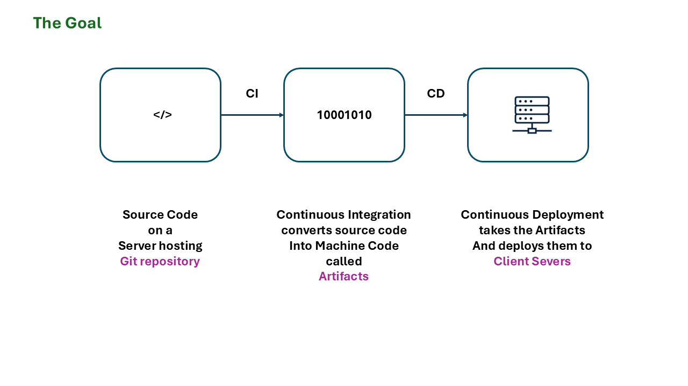
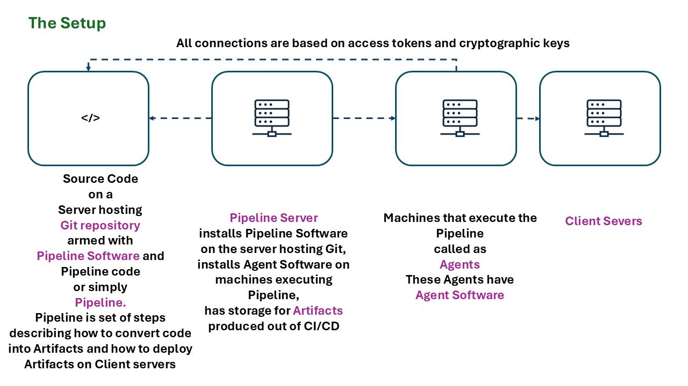
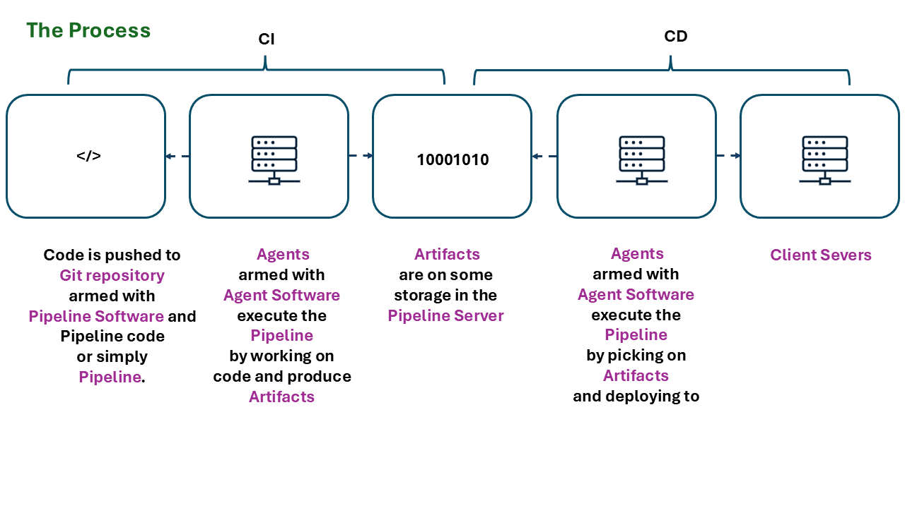

**CI/CD Pipelines**  
**Purpose –**  
The main asset of software is its source code, and software works when this code is deployed to the client machine. Unlike hardware, software isn’t rigid, and clients often want software that adapts to their needs, tastes, and changing business conditions. Therefore, it’s crucial for those who build software to be agile.

A major roadblock to agile software development is the time it takes to build or modify software and deliver it to the client, while maintaining quality. CI/CD (Continuous Integration/Continuous Deployment) is central to achieving agility.

- **CI** (Continuous Integration) is the process of automatically converting source code into machine-compatible artifacts.
- **CD** (Continuous Deployment) is the process of automatically placing these artifacts on the client’s servers, ensuring that the latest software updates are quickly available for use.

**Entities –**  
CI/CD is a complex system that involves several key components:

1. **Git Repository:** Where source code is maintained and version-controlled using Git.
2. **Pipeline Server:** A server that manages CI/CD processes and provides storage. It acts as the platform for performing CI/CD tasks.
3. **Pipeline Software:** This software, installed on the Git repository's host server, handles the automatic building of source code (the CI process). A build refers to the process of converting source code into machine code (artifacts).
4. **Artifacts:** The output of CI, artifacts are the machine-readable result of building the source code. These are deployed during CD so the client can use the latest version of the software.
5. **Agent Machines:** These machines execute the CI/CD tasks. Each machine runs an agent software that reads pipeline steps from the Git repository, converts source code into artifacts (CI), and deploys the artifacts to the client machine (CD). Agents are typically task-specific, performing one step of the process before terminating. Multiple agents work in sequence to complete the CI/CD process.

**Process –**  
At a high level, CI/CD typically involves these steps:

1. **Pipeline Setup:** The pipeline server installs the pipeline software on the Git repository's host. Pipeline code, which is a series of instructions (usually written in YAML), defines the steps needed to convert the source code into artifacts and details about where to deploy these artifacts. The pipeline code resides within the Git repository, alongside the source code.
2. **Agent Setup:** Agent machines are prepared with agent software, giving them access to the Git repository containing the source and pipeline code. These agents communicate with the Git server using access tokens and cryptographic keys. They also have access to the pipeline server (to store and retrieve artifacts) and the client machine (to deploy the artifacts).
3. **CI/CD Execution:** Once the setup is complete, developers can push changes to the Git repository. This automatically triggers the pipeline, causing agent machines to execute the steps outlined in the pipeline code.
    - **CI Completion:** The source code is converted to artifacts (machine-compatible files).
    - **CD Completion:** The artifacts are deployed to the client machine.
4. **Error Handling:** If there is any error in the process, the pipeline halts, and no changes are made. If the process succeeds, the software, including any modifications, is automatically available to the client.

