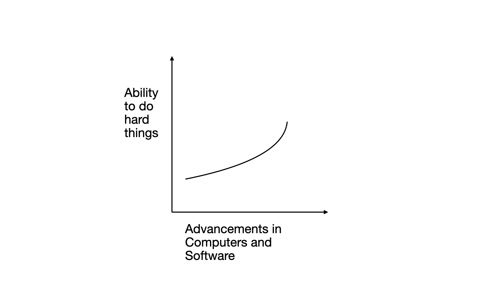

**Well, What is a Computer?**

**Computers** are things that **help humans do the hard things.** Things that are hard for a human with regards to recording, calculating, reasoning, collaborating, and making decisions, without technology assistance. Ok, this looks like a good enough answer to me. Then, with the talk of AI everywhere, and having read and gained some understanding of what's really happening, I am kind of **thinking about a Computer in 4-5 different phases, each built on top of the success of its previous state!**

**Phase 1: Calculation and Speed ->** This is where PCs started becoming a part of our daily lives. A Computer was something humans could program for any algorithm. The Computer did that with lightning speed which humans would never be able to. **Think of Book Keeping, playing a game instantaneously on a personal device.** Yes there were computers before the PCs, but a Computer for the masses, that's when it got us all to really have an assisstant machine to record our stuffs and free us for other important things.

**Phase 2: Network and Data ->** This is where there was Internet and suddenly Knowledge was not luxury anymore. Humans connected the various computers of the world and allowed data to be shared. The Internet and servers enabled sharing and storing infinite knowledge. **Think of watching a Tennis match live without actually being there in the stadium or seamlessly booking a train ticket without physically going to the station or listening to an MIT Professor's lecture for free**

**Phase 3: Intelligence and Agentic ->** This is where all the AI stuffs are starting to directly impact us at the masses level. An important reminder for us is that **Artificial Intelligence is emotion less, Human Intelligence has emotions!** Intelligence in Computers at the end of the day is just sophisticated mathematics running on chips, it will never have judgement of a human. Now, with consumer scale AI tools, Computers could now do tasks on our behalf with something called agents that would automatically do stuffs like researching long reports, finding concert tickets, writing good English. **Think of a future mobile phone that talks with apps automatically and thus is a very personal device behaving uniquely as us, helps us in making decisions faster or doing trivial things on our behalf.**

**Phase 4: Spatial and Cognitive ->** This is where the consumer devices are smartglasses, health tracking wearables, these are starting to show up slowly. Eventually a Computer should become a robot doing laundary for us so that we could relax. **Eventually we could be wearing glasses and seamlessly switching between real physical world and digital spatial world**, watching movies, playing games, recording videos while travelling along with talking to real people!

**Phase 5: Superintelligent and Evil or Savior? ->** We are at the initial stages of phase 3 and 4. This is my skepticism that after phase 3 and 4 succeed, **a few rigid evil hands could dominate the geo politics of the world by promoting radical ideas and extreme beliefs using the Computers of phase 5, what if they enable a small group of individuals having the most lethal weapons or the governments spy on every citizen, power can easily be evil** On the other side, I also have a naive optimism that maybe if phase 3 and 4 succeed, **Computers of phase 5 would eventually help us solve climate change, poverty, governments, and diseases.** Maybe there would be a mix of both good and bad as it always happens with all the Technology advancements.

Each phase has developed in overlap, not erasing the previous phase completely. I personally believe in being **optimistic** and supportive of keeping a **human in the loop** always. Let there be optimization on letting the **computer figure out the 'how'**, and let **a human finalise the 'what', the 'what not', and the 'why'**.

**We can outsource the thinking to a computer, but let's not outsource the decision making to any computer!** Let humans have the freedom to decide the most important things, things that have significant impact. The ethics in Technology is as important as the Technology itself, now more than ever.

